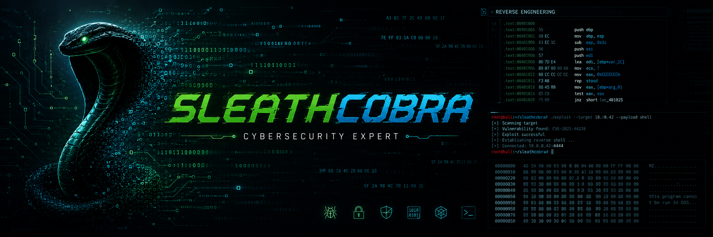

  

  <strong>🎓 Math Undergrad | 🔬 Low-level / Reverse Engineering | 💻 Open Source Contributor</strong>

  <!--  -->
  
  

---

### 🔬 Academic & Research Profile

I am a university mathematics student navigating the intersection of formal logic, low-level programming, and software security. This profile serves as a central repository for my open-source contributions, personal labs, and notes as I learn reverse engineering and system internals.

- 📐 **Academic Focus:** Computational mathematics, discrete structures, and cryptography basics.

- ⚙️ **Current Milestones:** Mastering x86/x64 assembly, writing custom tools in Rust/C++, and documenting malware analysis methodologies.

- 🌱 **Community Goals:** Sharing my learning journey openly, contributing to community tools, and learning in public.

---

### 💻 The Learning Matrix

| Area of Study | Current Focus & Tooling |
| --- | --- |
| **Reverse Engineering** | Learning static analysis with Ghidra/IDA PRO/Binja & fundamental debugging with x64dbg/GDB. |
| **Systems & Languages** | Exploring C, C++, and Rust with an emphasis on safe code architecture. |
| **Mathematics** | Discrete math, linear algebra, and modular arithmetic applied to computer science. |
| **Security Concepts** | Analyzing historical software vulnerabilities and standard defensive mitigations. |
